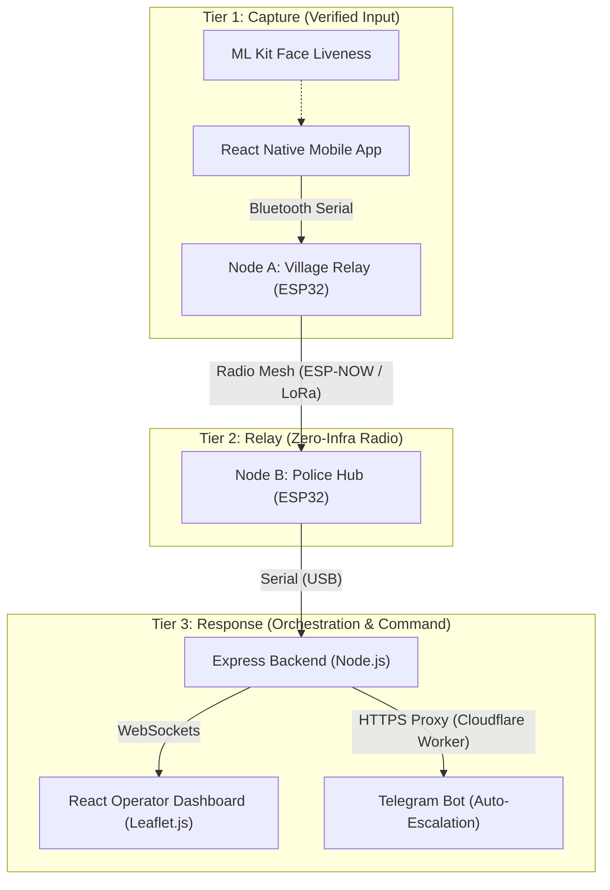

# 🚓 Prahari-Link (प्रहरी-Link)
> **Offline-First Zero-Infrastructure Emergency Communication Bridge**
>
> *Winner Project — Team Special Bandits — Nepal Police Hackathon 2026*

---

[](#)
[](#)
[](#)
[](#)
[](#)
[](#)

Prahari-Link is a public safety system designed for low-connectivity, geographically challenging regions in Nepal. It bridges modern mobile devices with low-power, long-range radio networks, ensuring that remote ward offices, schools, and citizens can transmit verified emergency alerts to Nepal Police command posts even when cellular networks, Wi-Fi, and data connections are completely down.

---

## 🗺️ System Architecture

Prahari-Link operates on a three-tier communication topology:



1. **Detection & Verification**: An authorized community representative (e.g. Ward Chief, School Teacher) opens the mobile app, completes a front-camera **Face Liveness Check (ML Kit)** to verify identity (preventing spoofing/abuse), and transmits the SOS over local **Bluetooth Serial** to the nearest Village Relay.
2. **Offline Relay**: The **Village Relay (Node A)** broadcasts the alert over a local radio mesh (using **ESP-NOW** for the prototype, designed for **LoRa**) to the nearest **Police Hub (Node B)**.
3. **Command & Triage**: The Police Hub parses the signal, sends it via **USB Serial** to the Command Center server, which dynamically visualizes the alert on a web dashboard, rings a siren, auto-broadcasts BLE alerts to local volunteers, and auto-escalates via **Telegram/SMS** if response times exceed 5 minutes.

---

## 🚀 Quick Start (Demo Mode)

We have unified the demo boot process into a single script. It automatically wipes stale databases, checks the Serial Hub interface, detects your active local network IP address, and launches the entire services stack.

### Prerequisites

Make sure you have Node.js, npm, and `fuser` installed:
```bash
node --version
npm --version
```

### 1. Launch the Ecosystem

Run the unified demo script in the root directory:
```bash
chmod +x ./run_demo.sh
./run_demo.sh
```

This launches:
* **Operator Dashboard**: `http://<your-network-ip>:5173`
* **Express backend**: `http://<your-network-ip>:3001`
* **Raw Serial Listener**: Subscribes to `/dev/ttyUSB0` (Police Hub Node B)

### 2. Inject Mock Telemetry (For Dry Runs)

To test the system without active ESP32 hardware, open a second terminal and trigger the mock injector client:
```bash
cd backend
node mock_injector.js
```
The injector will stream active simulated emergencies (Fires, Landslides, Medical Emergencies) and phone BLE volunteer scans directly into the backend every 10 seconds.

---

## 🔒 Restricted Network Workaround (Telegram Gateway Proxy)

If `api.telegram.org` is blocked or times out on your demo venue's Wi-Fi network:
1. We have configured the backend to route notifications through a custom HTTPS Gateway Proxy.
2. We deployed a reverse proxy Cloudflare Worker at `https://plink.anuditkhatri2011.workers.dev/` that is pre-loaded in the launcher script.
3. Alternatively, you can run the demo by switching your presentation laptop's Wi-Fi to a **Mobile Hotspot** (e.g. Ncell or NTC), which do not filter Telegram traffic.

---

## 📁 Directory Structure

```
├── backend/            # Express, Socket.IO, SQLite logic, and mock data generators
├── dashboard/          # React, Vite, Leaflet GIS map dashboard client
├── mobile_app/         # React Native (Android) source code, including Vision Camera
│   └── android/        # Native Android configurations, signed keystores, and build setups
├── firmware/           # C++/Arduino files for ESP-A (Relay) & ESP-B (Police Hub)
├── PrahariLinkMobile.apk # Prebuilt, signed production Android application
└── run_demo.sh         # Unified launcher, log tailer, and process controller
```

---

## 🛠️ Tech Stack & Protocols

* **Core Stack**: React, Vite, Tailwind CSS, Leaflet Map API.
* **Backend Engines**: Node.js, Express, Socket.IO (WebSockets), SQLite (`better-sqlite3`).
* **Mobile Engine**: React Native (Android), Vision Camera v3, ML Kit Face Detection, Expo battery/location hooks.
* **Wireless Channels**: ESP-NOW Radio (Offline Range), Classic Bluetooth Serial (App-to-Node), BLE Advertising (Broadcast to local responders).

---
*Developed by Team Special Bandits for the Nepal Police Hackathon 2026.*
